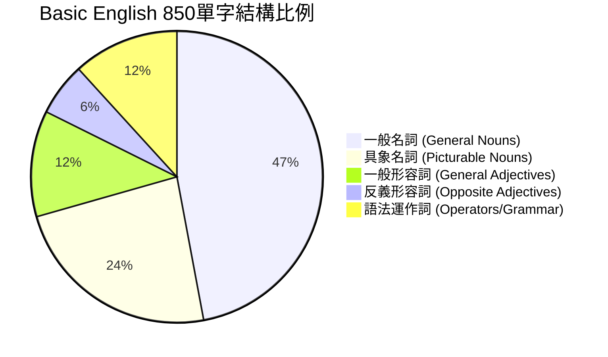

# 850 個單字的分類結構

C.K. Ogden 創立的 Basic English 並非隨機挑選 850 個單字，而是經過嚴密的語言學統計與邏輯推導，挑選出英語中最具**「互補性」**與**「包容性」**的詞彙。

這 850 個單字被稱為 **「Ogden's Basic English Word List」**，其結構呈現一個完美的黃金比例：

---

## 📂 850 單字三大分類與設計邏輯

### 1. 名詞 (Nouns) — 共 600 字 (佔比 70.5%)
名詞是表達「實體事物」與「抽象概念」的基石。奧格登將其細分為兩類：
*   **一般名詞 (General Nouns) — 400 字**：
    - 表達抽象概念、社會結構、科學術語或一般範疇。
    - *代表字*：*act, adjustment, agreement, belief, control, detail, government, industry, language, observation, science, transport, year*.
*   **具象名詞 (Picturable Nouns) — 200 字**：
    - 指「可以畫出實體圖像」的具體物體、人體部位或動植物。這對初學者的**視覺化記憶**極有幫助。
    - *代表字*：*apple, baby, bag, camera, carriage, eye, finger, garden, kettle, pocket, table, umbrella, wheel, window*.

### 2. 形容詞 (Qualities) — 共 150 字 (佔比 17.6%)
形容詞用於修飾事物狀態、特徵或評價。奧格登將其拆分為兩大極性：
*   **一般形容詞 (General Adjectives) — 100 字**：
    - 表達基礎狀態或正面特徵。
    - *代表字*：*able, automatic, beautiful, clean, complex, empty, free, natural, simple, wise*.
*   **反義/否定形容詞 (Opposite Adjectives) — 50 字**：
    - 用於表達相反特徵或負面狀態，透過「對比」大幅減少單字記憶負擔。
    - *代表字*：*bad, cold, dirty, false, ill, poor, rough, sad, wrong*.

### 3. 語法運作詞 (Operators & Grammar) — 共 100 字 (佔比 11.8%)
這是整個語言系統的「骨架」與「粘合劑」，用於連結句子、指示方向及代稱人稱：
*   **18 個核心算子**：16 個動詞與 2 個情態助動詞（見 [[Basic_English_Operators|18 個核心動詞/運作詞]]）。
*   **人稱與關係代名詞**：*I, you, he, she, it, they, who, which, this, that*.
*   **方向性介系詞**：*about, across, after, against, among, at, before, between, by, down, from, in, off, on, over, through, to, under, up, with*.
*   **邏輯連接詞與副詞**：*and, because, but, or, if, when, where, why, how, no, not, very*.
*   **數量詞**：*all, any, every, no, other, some, much, little*.

---

## 💡 850 字的語意膨脹原理

奧格登指出，850 個字看似極少，但因為英語具有豐富的**「多義性（Polysemy）」**，每個單字平均有 3 至 5 個常用義項。
例如，`head` 不僅可以代表「頭部（具象名詞）」，也可以代表「領導者（抽象名詞）」或「前方（方向）」。
因此，透過**語意延伸（Extension）**與**隱喻（Metaphor）**，850 個 Basic English 單字實際能覆蓋的日常語意範疇，相當於一般英語的 **5,000 個單字以上**。

---

## 🔗 關係與連結

- **屬於本專案主頁之子頁面**：[[Basic_English_Index|基礎英語總覽 @child_of]]
- **其他子概念頁面**：
  - [[Basic_English_Operators|18 個核心動詞/運作詞 @sibling_of]] (100 個語法詞中最關鍵的動詞子集)
  - [[Basic_English_Phrasal_Verbs|動詞片語的代換組合 @sibling_of]] (利用 850 字中的介系詞與動詞進行配對代換)

---

## 🎯 FSI Pattern Drill

> [!tip] 基礎句
> We can write simple books with a **small number** of words.
> 我們可以用少量的單字寫出簡單的書。

### 1️⃣ Substitution Drill（替換練習）

| Prompt | Expected Response |
|---|---|
| letters | We can write simple **letters** with a **small number** of words. |
| read | We can **read** simple books with a **small number** of words. |
| a list | We can write simple books with **a list** of words. |
| Children | **Children** can write simple books with a **small number** of words. |

### 2️⃣ Transformation Drill（轉換練習）

| Transformation | Expected Response |
|---|---|
| → Negative | We **cannot** write simple books with a small number of words. |
| → Question | **Can we** write simple books with a small number of words? |
| → Past Tense | We **could** write simple books with a small number of words. |
| → Passive Voice | Simple books **can be written** with a small number of words. |

### 3️⃣ Response Drill（應答練習）

| Prompt | Expected Response |
|---|---|
| Can we write simple books with a small number of words? | Yes, we can write simple books with a small number of words. |
| What can we write with a small number of words? | We can write simple books with them. |
| Who can write simple books with a small number of words? | Learners and teachers can write simple books with a small number of words. |
| How many words do we need to write simple books? | We only need a small number of words to write them. |

### 4️⃣ Expansion Drill（擴展練習）

| Step | Sentence |
|---|---|
| 核心 | We write books. |
| +adjective | We write **simple** books. |
| +prepositional phrase | We write simple books **with words**. |
| +modifier | We write simple books with **a small number of** words. |
| +modal | **We can** write simple books with a small number of words. |
