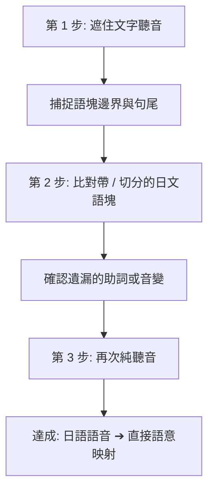

# 🗾 24_Chunking_語塊與聽力自動化訓練 (Japanese Chunking & Automaticity)

> [!quote] 核心設計哲學 (Core Philosophy)
> **訓練的核心目標不是孤立死背單字與死記文法規則，而是建立從「連續語音」到「直覺語意」的映射能力。**
> 
> * **斷句切割 (Speech Segmentation)**：識別連續日語中的自然意群，擺脫以個別助詞機械切碎句子的習慣。
> * **高句型重複度 ＋ 高例句變化度 ＋ 低重複句**：避免枯燥的單句鸚鵡學舌，透過大量不同情境的句子反覆刻印同一個句型結構。
> * **句尾錨點意識**：日語的肯定、否定、推測或請求關鍵永遠在句末，習慣等待句尾語塊出現再作判斷。
> * **主受詞省略適應**：習慣日常生活與旅遊中高頻的上下文省略，不強求還原「私は」。

> [!tip] 🎧 全套 Day 01 ～ Day 15 連續磨耳朵音軌已全數實裝！
> 每張卡片頂部均已內嵌專屬沉浸音軌（Nanami 神經女聲・微軟真人級發音）。
> 包含：**語塊朗讀 ➔ 1.5 秒跟讀留白 ➔ FSI 意群代入 ➔ 1.8 秒盲聽反射槽 ➔ 語體轉換**，通勤或步行時即可閉眼訓練聲音記憶！

---

## 🗂️ 每日卡片導覽 (Daily Training Cards MOC)

| 日期卡片 | 日期 | 核心目標句型 / 語塊 | 情境摘要 |
| :--- | :--- | :--- | :--- |
| [[Day_01_Chunking_Training|Day 01 @parent_of]] | 2026-09-12 | `〜てもいい（ですか）`、`〜てみる`、`〜たほうがいい`、`〜と思う` | 請求許可、初次嘗試、溫和建議與表達個人想法。 |
| [[Day_02_Chunking_Training|Day 02 @parent_of]] | 2026-09-13 | `〜んです`、`〜ておく（〜とく）`、`〜てしまう（〜ちゃう）`、`〜かもしれない` | 求助背景陳述、事前準備與口語縮約、懊惱遺憾與機率推測。 |
| [[Day_03_Chunking_Training|Day 03 @parent_of]] | 2026-09-14 | `〜てくれる`、`〜てもらう`、`〜なくてはいけない（〜なきゃ）`、`〜ている（〜てる）` | 他人代勞恩惠、最禮貌請託、口語義務縮約與狀態持續。 |
| [[Day_04_Chunking_Training|Day 04 @parent_of]] | 2026-09-15 | `〜たことがある`、`〜つもり（です）`、`〜そう（です）［樣態］`、`〜なくてもいい` | 個人經驗詢問、預定行程陳述、直觀外觀推測與免除義務。 |
| [[Day_05_Chunking_Training|Day 05 @parent_of]] | 2026-09-16 | `〜ことになる`、`〜ことにする`、`〜ようにする`、`〜みたい` | 客觀安排決定、個人主觀抉擇、努力維持習慣與直觀口語推測。 |
| [[Day_06_Chunking_Training|Day 06 @parent_of]] | 2026-09-17 | `〜てはいけない（〜ちゃだめ）`、`〜ようになる`、`〜らしい`、`〜わけではない` | 禁止規範、能力與習慣演變、客觀傳聞與委婉部分否定。 |
| [[Day_07_Chunking_Training|Day 07 @parent_of]] | 2026-09-18 | `〜てあげる`、`〜ことがある`、`〜たらどうですか`、`〜はず` | 代勞協助提議、客觀偶發現象、委婉提議建議與高把握推斷。 |
| [[Day_08_Chunking_Training|Day 08 @parent_of]] | 2026-09-19 | `〜やすい / 〜にくい`、`〜たばかり`、`〜すぎる（〜すぎちゃった）`、`口語銜接語塊` | 動作好壞做易難、時間臨近感、程度過多與即時修正銜接語塊。 |
| [[Day_09_Chunking_Training|Day 09 @parent_of]] | 2026-09-20 | `〜かどうか`、`〜し、〜し`、`〜ように［丁寧指示］`、`口語思維語塊` | 確認不確定事項、多重理由並列、委婉叮嚀與三大直覺思維語塊。 |
| [[Day_10_Chunking_Training|Day 10 @parent_of]] | 2026-09-21 | `〜ながら`、`〜ばかり（〜てばっか）`、`〜がる / 〜たがる`、`口語應答語塊` | 同時並行動作、過度頻率感嘆、第三人稱願望與點餐問答起手式。 |
| [[Day_11_Chunking_Training|Day 11 @parent_of]] | 2026-09-22 | `〜前に / 〜後で`、`〜たら`、`〜ために`、`口語呼應語塊` | 時間前後順序、觸發時機假設、目的說明與對話呼應起手式。 |
| [[Day_12_Chunking_Training|Day 12 @parent_of]] | 2026-09-23 | `〜てから`、`〜と［指路導航］`、`〜ても / 〜でも`、`口語程度轉折語塊` | 先後前提條件、必然結果與指路、讓步條件與意外轉折語塊。 |
| [[Day_13_Chunking_Training|Day 13 @parent_of]] | 2026-09-24 | `〜てほしい`、`〜そうだ［傳聞］`、`〜ば［假定］`、`情境確認語塊` | 直率期望他人協助、消息轉述、條件前提假定與三大情境應答核心。 |
| [[Day_14_Chunking_Training|Day 14 @parent_of]] | 2026-09-25 | `〜ていく / 〜てくる`、`〜のに`、`〜なら`、`句末終助詞聽力錨點` | 方向性與狀態推移、預期落空逆折、限定推薦與四大終助詞情感錨點。 |
| [[Day_15_Chunking_Training|Day 15 @parent_of]] | 2026-09-26 | `〜って［口語引用］`、`〜だけでなく`、`〜おかげで / 〜せいで`、`相槌接話語塊` | 萬能口語引述主題、範疇延伸遞進、正負因果責任與核心傾聽反饋。 |

---

## 🧠 學習流程建議 (Chunking Practice Protocol)

1. **Step A — 遮字聽音**：先不看文字，專注捕捉句子中的 2～4 個語塊邊界與句尾助動詞。
2. **Step B — 檢視語塊文本**：核對卡片上的 `/` 切分，檢查剛才是否有漏聽助詞（`は`、`が`、`を`、`に`、`で`）或口語縮約（`〜てる`、`〜とく`、`〜ちゃう`）。
3. **Step C — 不經中文直接對應**：避免在腦海中逐字翻譯成中文，直接將語塊關聯到情境。

---

## 🔗 相關知識庫連結 (Related Concept Notes)
* [[Japanese_Grammar_Index|日文高頻文法索引 @uses]]
* [[Daily_Phrases_Index|日常必備常用句100句 @related_to]]
* [[Keigo_Casual_100_Index|敬語與口語對照100句 @related_to]]
* [[Japanese_Learning_System|日語學習系統總指揮中心 @related_to]]
* [[index|返回 HML Wiki 總索引 @child_of]]
