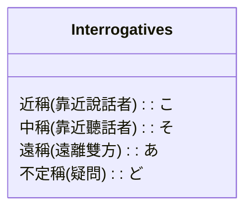

---
part_of:
  - "[[Japanese_Learning_System]]"
---
# 🇯🇵 日語生活常用其他詞性指南（副詞・接續詞・指示代名詞）

> [!important] 句子結構色彩標記：
> 🟢 **主語/主題** (`#2ECC71`) \| 🔵 **核心/謂語** (`#3498DB`) \| 🟠 **修飾語/賓語** (`#E67E22`) \| 🔴 **時間/場所/副詞** (`#E74C3C`)

---

## 📂 第一部分：副詞（Adverbs）

日語中的副詞主要用來修飾**動詞**、**形容詞**或其他**副詞**，說明動作的狀態、程度或說話者的心理態度。副詞**沒有語形變化**。

### 1. 常見副詞分類與例句

| 副詞分類 | 常見生活單字 | 語義說明 | 結構例句 |
| :--- | :--- | :--- | :--- |
| **① 狀態副詞**  (修飾動作狀態) | **ゆっくり**  **はっきり**  **うっかり** | 慢地、安穩地  清楚地、明確地  不小心地、大意地 | ゆっくり話してください。  （請慢慢說。） |
| **② 程度副詞**  (修飾狀態深淺) | **とても / 大変**  **少し / ちょっと**  **だんだん** | 非常  稍微、一點點  漸漸地、逐步地 | 日本語はとても面白いです。  （日文非常有趣。） |
| **③ 呼應副詞**  (後方需接否定等) | **全然 + 否定**  **決して + 否定**  **たぶん + 推測** | 完全不...  決不...  大概、也許... | 英語は全然分かりません。  （英語我完全不懂。） |

---

## 📂 第二部分：接續詞（Conjunctions）

接續詞用於連接句子與句子、或段落與段落，建立邏輯關係（如因果、轉折、並列）。

### 1. 常見接續詞分類與例句

| 邏輯關係 | 常見接續詞 | 中文釋義 | 結構例句 |
| :--- | :--- | :--- | :--- |
| **① 因果關係**  (前因後果) | **だから / ですから**  **それで** | 所以、因此  因此、於是 | 雨が降りました。**だから、**行きませんでした。  （下雨了。所以，我沒去。） |
| **② 轉折關係**  (前後相反) | **しかし**  **でも / けれども** | 然而、但是  可是、不過 | 彼は頭が良いです。**でも、**勉強しません。  （他很聰明。但是，他不學習。） |
| **③ 並列與遞進**  (補充說明) | **そして**  **それに** | 而且、然後  而且、再加上 | 果物を買いました。**そして、**パンも買いました。  （買了水果。然後，也買了麵包。） |

---

## 📂 第三部分：指示代名詞（Pronouns - こ・そ・あ・ど）

日語中以「こ（近稱）」、「そ（中稱）」、「あ（遠稱）」、「ど（不定稱/疑問）」開頭的代名詞，稱為 **こそあど系列**，用於指代事物、場所、方向等。

### 1. 指示代名詞矩陣對照表

| 指代類別 | こ系列 (近稱/我方) | そ系列 (中稱/你方) | あ系列 (遠稱/他方) | ど系列 (不定/疑問) | 語法特性與接續 |
| :--- | :--- | :--- | :--- | :--- | :--- |
| **① 事物代名詞**  (代替物品) | **これ**  (這個) | **それ**  (那個) | **あれ**  (那個/遠處) | **どれ**  (哪個) | **獨立作主語/賓語**。後面可直接接助詞。   例：`これは本です。` |
| **② 連體詞**  (修飾名詞) | **この**  (這...) | **その**  (那...) | **あの**  (那.../遠處) | **どの**  (哪個...) | **不可獨立使用**。後面**必須緊接名詞**。   例：`この本は面白いです。` |
| **③ 處所代名詞**  (代替場所) | **ここ**  (這裡) | **そこ**  (那裡) | **あそこ**  (那裡/遠處) | **どこ**  (哪裡) | 指代地理空間位置。   例：`ここは教室です。` |
| **④ 方向與人稱**  (禮貌指代) | **こちら**  (這邊/我方) | **そちら**  (那邊/你方) | **あちら**  (那邊/遠方) | **どちら**  (哪邊/哪位) | 禮貌指代方向、場所或人。   例：`どちら様ですか。` |

---

## 🔗 相關文法卡片連結
副詞、接續詞與代名詞常與下列基礎助詞搭配使用：
*   **指示代名詞接續**：
    *   [[JP_Grammar_01_wa_desu|〜は〜です (指示代名詞作主語)]]
    *   [[JP_Grammar_02_no|〜の (連體詞修飾名詞/代名詞所有格)]]
    *   [[JP_Grammar_03_ni_he|〜に / 〜へ (處所/方向代名詞後續助詞)]]
*   **因果轉折接續**：
    *   [[JP_Grammar_10_kara_reason|〜から（原因） (句尾因果接續)]]
    *   [[JP_Grammar_27_node|〜ので (因果轉折句)]]
