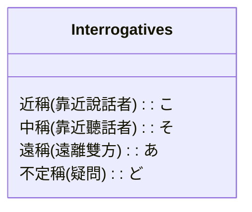

# 🇯🇵 日語生活常用其他詞性指南（副詞・接續詞・指示代名詞）

> [!important] 句子結構色彩標記：
> >  **主語/主題** (`#2ECC71`) \|  \|  **核心/謂語** (`#3498DB`) \|  \|  **修飾語/賓語** (`#E67E22`) \|  \|  **時間/場所/副詞** (`#E74C3C`)

---

## 📂 第一部分：副詞（Adverbs）

日語中的副詞主要用來修飾**動詞**、**形容詞**或其他**副詞**，說動作的狀態、程度或說者的心理態度。副詞**沒有語形變化**。

### 1. 常見副詞分類與例句

| 副詞分類 | 常見生活單字 | 語義說 | 結構例句 |
| :--- | :--- | :--- | :--- |
| **① 狀態副詞**  (修飾動作狀態) | **ゆっくり**  **はっきり**  **うっかり** | 慢地、安穩地  清楚地、明確地  不小心地、大意地 | ゆっくり<ruby>話<rt>はな</rt></ruby>してください。  （<ruby>請<rt>せい</rt></ruby><ruby>慢<rt>まん</rt></ruby><ruby>慢<rt>まん</rt></ruby><ruby>說<rt></rt></ruby>|
| **② 程度副詞**  (修飾狀態深淺) | **とても / 大変**  **少し / ちょっと**  **だんだん** | 非常  稍微、一點點  漸漸地、逐步 | 日本語はとても面白いです。  （日文非常有趣。） |
| **③ 呼應副詞**  (後方需接否定等) | **全然 + 否定**  **決して + 否定**  **たぶん + 推測** | 完全不...  決不...  大概、也許... | <ruby>英語<rt>えいご</rt></ruby>は<ruby>全然<rt>ぜんぜん</rt></ruby><ruby>分<rt>わ</rt></ruby>かりません。  （<ruby>英語<rt>えいご</rt></ruby><ruby>我<rt>われ</rt></ruby><ruby>完全<rt>かんぜん</rt></ruby><ruby>不<rt>ふ</rt></ruby><ruby>懂<rt></rt></ruby>|

---

## 📂 第二部分：接續詞（Conjunctions）

接續詞用於連接句子與句子、或段落與段落，建立邏輯關係（如因果、轉折、並列）。

### 1. 常見接續詞分類與例句
 
 | 邏輯關係 | 常見接續詞 | 中文釋義 | 結構例句 |
 | :--- | :--- | :--- | :--- |
 | **① 因果關係**  (前因後果) | **だから / ですから**  **なので**  **それで / そのため**  **その結果 / 従って**  **こうして / だからこそ** | 所以、因此  因為、所以  因此、於是 / 因此、因為那原因  結果 / 因此、從而（正式）  就這樣 / 正因如此 | <ruby>雨<rt>あめ</rt></ruby>が<ruby>降<rt>お</rt></ruby>りました。**だから、**<ruby>行<rt>い</rt></ruby>きませんでした。  <ruby>明日<rt>あした</rt></ruby>は<ruby>試験<rt>しけん</rt></ruby>です。**なので**<ruby>勉強<rt>べんきょう</rt></ruby>します。  <ruby>大雨<rt>おおあめ</rt></ruby>が<ruby>降<rt>お</rt></ruby>りました。**そのため**<ruby>電車<rt>でんしゃ</rt></ruby>が<ruby>止<rt>ど</rt></ruby>まりました。 |
 | **② 轉折關係**  (前後相反) | **しかし / でも / だけど**  **けれども / それでも**  **ただし / とはいえ**  **とは言っても / 一方で**  **逆に** | 然而、但是 / 不過、但是  雖然、但是 / 即使如此  但、不過 / 雖說雖如此  話雖如此 / 另方面  相反地、反過來說| <ruby>彼<rt>かれ</rt></ruby>は<ruby>頭<rt>あたま</rt></ruby>が<ruby>良<rt>よ</rt></ruby>いです。**でも、**<ruby>勉強<rt>べんきょう</rt></ruby>しません。  <ruby>雨<rt>あめ</rt></ruby>が<ruby>強<rt>つよ</rt></ruby>いです。**それでも**<ruby>行<rt>い</rt></ruby>きます。  この<ruby>席<rt>せき</rt></ruby>は<ruby>使<rt>つか</rt></ruby>えます。**ただし**1<ruby>時間<rt>じかん</rt></ruby>だけです。 |
 | **③ 順序與承接**  (邏輯遞進) | **そして / それから**  **その後 / 次に**  **まず / 最後に**  **そのまま / そしたら** | 而且、然後 / 之後、接著  之後、隨後 / 接下來、其次  首先 / 最後  直接就那樣 / 然後、結果 | <ruby>果物<rt>くだもの</rt></ruby>を<ruby>買<rt>か</rt></ruby>いました。**そして、**パンも<ruby>買<rt>か</rt></ruby>いました。  <ruby>宿題<rt>しゅくだい</rt></ruby>をします。**それから**テレビを<ruby>見<rt>み</rt></ruby>ます。  ドアを<ruby>開<rt>ひら</rt></ruby>けました。**そしたら**<ruby>猫<rt>ねこ</rt></ruby>がいました。 |

---

## 📂 第三部分：指示代名詞（Pronouns - こ・そ・あ・ど）

日語中以「こ（近稱）」、「そ（中稱）」、「あ（遠稱）」、「ど（不定稱/疑問）」開頭的代名詞，稱為 **こそあど系列**，用於指代事物、場所、方向等。

```mermaid
classDiagram
    class Interrogatives {
        近稱 (靠近說話者): こ
        中稱 (靠近聽話者): そ
        遠稱 (遠離雙方): あ
        不定稱 (疑問): ど
    }
```

### 1. 指示代名詞矩陣對照表

| 指代類別 | こ系列 (近稱/我方) | そ系列 (中稱/你 | あ系列 (遠稱/他方) | ど系列 (不定/疑問) | 語法特性與接續 |
| :--- | :--- | :--- | :--- | :--- | :--- |
| **① 事物代名詞**  (代替物品) | **これ**  (這個) | **それ**  (那個) | **あれ**  (那個/遠處) | **どれ**  (哪) | **獨立作主語/賓語**。後面可直接接助詞。   例：`これは本です。` |
| **② 連體詞**  (修飾名詞) | **この**  (這...) | **その**  (那...) | **あの**  (那.../遠處) | **どの**  (哪...) | **不可獨立使用**。後面**必須緊接名詞**。   例：`この本は面白いです。` |
| **③ 處所代名詞**  (代替場所) | **ここ**  (這裡) | **そこ**  (那裡) | **あそこ**  (那裡/遠處) | **どこ**  (哪) | 指代地理空間位置。   例：`ここは教室です。` |
| **④ 方向與人稱**  (禮貌指代) | **こちら**  (這邊/我方) | **そちら**  (那邊/你) | **あちら**  (那邊/遠方) | **どちら**  (哪/哪) | 禮貌指代方向、場所或人。   例：`どちら様ですか。` |

---

## 🔗 相關文法卡片連結
副詞、接續詞與代名詞常與下列基礎助詞搭配使用：
*   **指示代名詞接續**：
    *   [[JP_Grammar_01_wa_desu|〜は〜です (指示代名詞作主語)]]
    *   [[JP_Grammar_02_no|〜の (連體詞修飾名詞/代名詞所有格)]]
    *   [[JP_Grammar_03_ni_he|〜に / 〜へ (處所/方向代名詞後續助詞)]]
*   **因果轉折接續**：
    *   [[JP_Grammar_10_kara_reason|〜から（原因） (句尾因果接續)]]
    *   [[JP_Grammar_27_node|〜ので (因果轉折句)]]
