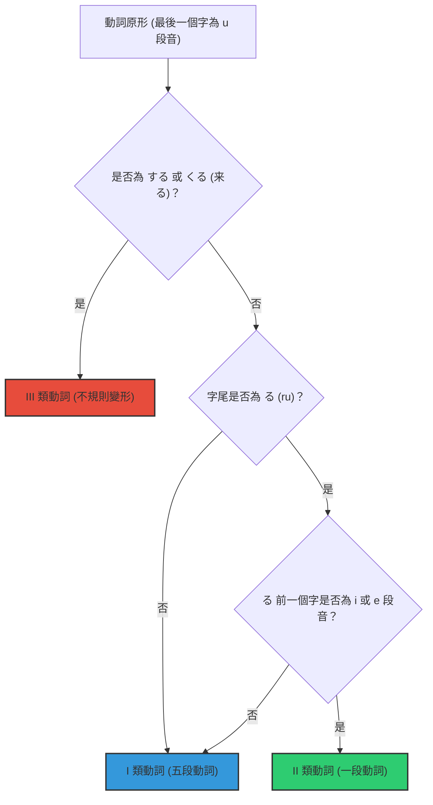

# 🇯🇵 日語動詞分類與九大語形變化指南

> [!important] 句子結構色彩標記：
> 🟢 **主語/主題** (`#2ECC71`) \| 🔵 **核心/謂語** (`#3498DB`) \| 🟠 **修飾語/賓語** (`#E67E22`) \| 🔴 **時間/場所/副詞** (`#E74C3C`)

---

## 📂 第一部分：動詞分類判斷

日語動詞依其字尾及變形規律分為三大類。快速判定方法如下：

> [!warning] I 類動詞（五段動詞）的特例（る前為 i/e 段音卻屬於 I 類）：
> - **帰る（かえる / 回家）**、**入る（はいる / 進入）**、**走る（はしる / 奔跑）**、**知る（しる / 知道）**、**切る（きる / 剪切）**。

---

## 📂 第二部分：動詞九大基本變形規則與例句對照

| 變形種類 | I 類動詞 (以「書く」/「買う」為例) | II 類動詞 (以「食べる」為例) | III 類動詞 (以「する」/「来る」為例) | 語境與結構例句 |
| :--- | :--- | :--- | :--- | :--- |
| **① 辭書形**  (原形/字典形) | 字尾以 **u段音** 結尾。   例：`書く` (kaku) / `買う` (kau) | 去掉字尾 **る**。   例：`食べる` (taberu) | `する` (suru / 做)   `来る` (kuru / 來) | 私は本を書く。  （我寫書。） |
| **② ます形**  (丁寧形/禮貌) | 字尾 **u段** 變為 **i段** + `ます`。   例：`書きます` / `買います` | 去掉 **る** + `ます`。   例：`食べます` | `します` (shimasu)   `来ます` (kimasu) | 先生は明日来ます。  （老師明天會來。） |
| **③ て形**  (連接/進行) | **促音便** (う/つ/る → って)  **鼻音便** (ぬ/ぶ/む → んで)  **い音便** (く → いて / ぐ → いで)   例：`書いて` / `買って` | 去掉 **る** + `て`。   例：`食べて` | `して` (shite)   `来て` (kite) | リンゴを食べてください。  （請吃蘋果。） |
| **④ た形**  (過去式/完成) | 變形規律與 **て形** 完全一致，`て` 變 `た`，`為` 變 `だ`。   例：`書いた` / `買った` | 去掉 **る** + `た`。   例：`食べた` | `した` (shita)   `来た` (kita) | 昨日、彼が来た。  （昨天他來了。） |
| **⑤ ない形**  (否定/未然) | 字尾 **u段** 變為 **a段** + `ない` (う結尾變わ)。   例：`書かない` / `買わない` | 去掉 **る** + `ない`。   例：`食べない` | `しない` (shinai)   `来ない` (konai / 讀作 konai) | 私は肉を食べない。  （我不吃肉。） |
| **⑥ 可能形**  (能力/許可) | 字尾 **u段** 變為 **e段** + `る`。   例：`書ける` / `買える` | 去掉 **る** + `られる` (口語常簡略為 `れる`)。   例：`食べられる` | `できる` (dekiru)   `来られる` (koraredu / 讀作 koraredu) | 日本語が話せる。  （我會說日文。） |
| **⑦ 意向形**  (意志/勸誘) | 字尾 **u段** 變為 **o段** + `う`。   例：`書こう` / `買おう` | 去掉 **る** + `よう`。   例：`食べよう` | `しよう` (shiyou)   `来よう` (koyou / 讀作 koyou) | 一緒に映画を見よう。  （一起看電影吧！） |
| **⑧ 受身形**  (被動形) | 字尾 **u段** 變為 **a段** + `れる`。   例：`書かれる` / `買われる` | 去掉 **る** + `られる`。   例：`食べられる` | `される` (saredu)   `来られる` (koraredu) | 私は犬に噛まれた。  （我被狗咬了。） |
| **⑨ 使役形**  (讓/叫/使) | 字尾 **u段** 變為 **a段** + `せる`。   例：`書かせる` / `買わせる` | 去掉 **る** + `させる`。   例：`食べさせる` | `させる` (saseru)   `来させる` (kosaseru / 讀作 kosaseru) | 母は子供に勉強をさせる。  （母親讓孩子學習。） |

---

## 📂 第三部分：て形音便與特殊規則

### 1. 五段動詞「て形 / た形」音便口訣
五段動詞的「て形」與「た形」變化會根據字尾產生音便：
*   **字尾為「う、つ、る」**：變為 **促音便** `って` / `った`
    *   例：買う → 買って、待つ → 待って、取る → 取って
*   **字尾為「む、ぶ、ぬ」**：變為 **鼻音便** `んで` / `んだ`
    *   例：読む → 読んで、遊ぶ → 遊んで、死ぬ → 死んで
*   **字尾為「く」**：變為 **い音便** `いて` / `いた`
    *   例：書く → 書いて
*   **字尾為「ぐ」**：變為 **い音便（帶濁音）** `いで` / `いだ`
    *   例：泳ぐ → 泳いで
*   **字尾為「す」**：變為 `して` / `した`
    *   例：話す → 話して

> [!important] 唯一特例
> **行く（いく / 去）** 的字尾雖然是「く」，但其て形為促音便的 **行って（いって）**，請特別注意。

---

## 🔗 相關文法卡片連結
動詞的各種形變是學習日語句型的基礎，請參考以下關聯文法卡片：
*   **て形應用**：
    *   [[JP_Grammar_11_te_kudasai|〜てください (請做某事)]]
    *   [[JP_Grammar_12_te_imasu|〜ています (正在進行/狀態)]]
    *   [[JP_Grammar_13_te_mo_ii_desu|〜てもいいです (可以做某事)]]
    *   [[JP_Grammar_14_te_wa_ikemasen|〜てはいけません (不准做某事)]]
*   **ない形應用**：
    *   [[JP_Grammar_20_nai_de_kudasai|〜ないでください (請不要做某事)]]
    *   [[JP_Grammar_21_nakereba_narimasen|〜なければなりません (必須做某事)]]
    *   [[JP_Grammar_22_nakute_mo_ii_desu|〜なくてもいいです (不用做某事)]]
*   **た形應用**：
    *   [[JP_Grammar_17_tari_tari_shimasu|〜たり〜たりします (動作並列)]]
    *   [[JP_Grammar_18_ta_koto_ga_arimasu|〜たことがあります (曾經做過)]]
    *   [[JP_Grammar_19_ta_hou_ga_ii_desu|〜たほうがいいです (做某事比較好)]]
*   **其他重要形變**：
    *   [[JP_Grammar_15_tai_desu|〜たいです (想做某事 - 變化規律同い形容詞)]]
    *   [[JP_Grammar_23_koto_ga_dekimasu|〜ことができます (能夠做某事 - 接動詞原形)]]
    *   [[JP_Grammar_24_tsumori_desu|〜つもりです (打算做某事 - 接動詞原形)]]
