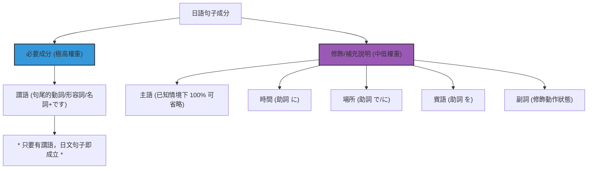

---
related_to:
  - "[[JP_Grammar_Verb_Conjugation]]"
  - "[[JP_Grammar_Noun_Conjugation]]"
  - "[[JP_Grammar_Adjective_Conjugation]]"
---
# 🇯🇵 日語造句、成分剖析與口語精簡指引

> [!important] 句子結構色彩標記：
> 🟢 **主語/主題** (`#2ECC71`) \| 🔵 **核心/謂語** (`#3498DB`) \| 🟠 **修飾語/賓語** (`#E67E22`) \| 🔴 **時間/場所/副詞** (`#E74C3C`)

本指南旨在幫助學習者建立地道的日語造句邏輯，理解日語句子中「必要成分」與「修飾成分」的權重，並掌握日語口語對話中極致精簡的原則與回覆格式。

---

## 📂 第一部分：三大核心句型架構

日語造句的基本邏輯是 **SOV 結構**（主語 - 賓語 - 動詞），且 **謂語（決定時態與語氣的核心部分）永遠放在句子最後面**。

### 1. 名詞判斷句 (A is B)
*   **架構**：`🟢 主語/主題` + **は** + `🔵 名詞` + **です / だ**。
*   **例句**：これは日本語の本です。  （這是日文書。）

### 2. 形容詞描述句 (A is Adjective)
*   **架構**：`🟢 主語/主題` + **は** + `🔵 形容詞` + **です / だ**。
*   **例句**：今日の天気は寒いです。  （今天的天氣很冷。）

### 3. 動詞敘述句 (A does B)
*   **架構**：`🟢 主語/主題` + **は** + `🔴 時間/場所` + `🟠 賓語` + **を** + `🔵 動詞`。
*   **例句**：私は今日、家で林檎を食べます。  （我今天在家吃蘋果。）

### 4. 四大詞類丁寧形語尾總表

三大句型的謂語變化，依詞類統一對照（詳細變化見各詞類專卡）：

|  | 動詞 | 名詞 | い形容詞（肯定保留い，其餘去い變化） | な形容詞 |
| --- | --- | --- | --- | --- |
| 肯定 | 〜ます | 〜です | 〜い＋です | 〜です |
| 否定 | 〜ません | 〜じゃありません | 〜くない＋です | 〜じゃありません |
| 過去肯定 | 〜ました | 〜でした | 〜かった＋です | 〜でした |
| 過去否定 | 〜ませんでした | 〜じゃありませんでした | 〜くなかった＋です | 〜じゃありませんでした |
| 勧誘 | 〜ましょう | ✕ | ✕ | ✕ |
| 推測 | ✕ | 〜でしょう↘ | 〜でしょう↘ | 〜でしょう↘ |
| 確認 | ✕ | 〜でしょう↗ | 〜でしょう↗ | 〜でしょう↗ |

> [!tip] でしょう 語調規則：句尾下降↘＝推測（大概吧）、上揚↗＝確認（對吧？）。

### 5. 連體修飾：四詞類接名詞規則

任何詞類都能修飾名詞，接法各不同——**動詞修飾名詞必須用普通體（辞書形/た形等），不可用ます形**：

| 詞類 | 接法 | 例 |
| --- | --- | --- |
| 名詞 | ＋の＋名詞 | 日本語**の**本 |
| い形容詞 | 直接＋名詞 | 安い本 |
| な形容詞 | ＋な＋名詞 | 有名**な**本 |
| 動詞（普通體） | 直接＋名詞 | 買っ**た**本、読**む**人 |

- 詳細變化：[[JP_Grammar_Verb_Conjugation|動詞變化 @related_to]]、[[JP_Grammar_Noun_Conjugation|名詞變化 @related_to]]、[[JP_Grammar_Adjective_Conjugation|形容詞變化 @related_to]]

---

## 📂 第二部分：句子成分的權重：必要成分 vs 修飾成分

日語在語言學上屬於**高度情境依賴**的「高語境語言」。這導致日語句子的必要與修飾成分有著與中文、英文截然不同的權重。

### 1. 唯一必要成分：謂語（句尾）
在日語中，唯一**在語意和語法上絕對不能省略**的，就是放在句尾的 **「謂語（動詞/形容詞/名詞+です）」**。只要謂語存在，即使沒有主語和賓語，句子依然完全成立。
*   例句：食べます。 (我要吃。 / 成立)
*   例句：寒いです。 (好冷。 / 成立)

### 2. 修飾與補充成分（可省略）
除了句尾謂語外，其他所有成分均屬於「補充說明」或「修飾」。只要在對話情境中雙方心知肚明，皆應予以省略：
*   **主語 / 主題（は / が）**：最容易被省略。日語極度忌諱反覆說 `私は` (我) 或 `あなたは` (你)。
*   **時間（に） / 場所（で / に）**：提供動作背景，非必要。
*   **賓語（を）**：動作承受者。若指著蘋果問「吃嗎？」，不需說「吃蘋果」，直接說「吃」即可。

---

## 📂 第三部分：口語對話的極致精簡法則

地道的日語口語聽起來非常簡短，主要透過以下三個法則進行精簡：

### 法則 ①：主語/主題「全面消失」
除非要強調「是誰」或「在對比什麼」，否則不說主語。
*   教科書式（贅言）：~~私は明日京都に行きます。~~
*   地道口語（精簡）：明日、京都に行く。 (明天去京都。)

### 法則 ②：名詞代用（Copula 代替動詞）
口語回答時，常直接用 **「名詞 + です（/ だ）」** 代替一整串動詞動作，日文稱為「鰻魚句（ウナギ文）」。
*   情境：詢問「你明天要去哪裡？」
*   一般回答：~~私は京都に行きます。~~ (我去京都。)
*   精簡回答：京都です。 (京都。/ 意即：去京都。)

### 法則 ③：時態與語氣助詞縮讀（Contractions）
口語中，進行時態或懊惱時態會進行音變縮讀：
*   `ています` (正在) → **てる** （例：知っている → **知ってる**）
*   `てしまいます` (不小心做完) → **ちゃう** （例：忘れてしまった → **忘れちゃった**）
*   `てはおけない` (不能不管) → **ちゃおけない**

---

## 📂 第四部分：地道問答與潛在回覆格式對照表

利用上述精簡原則，日常問答的實際潛在回覆格式如下：

| 情境與提問 | 教科書式回答 (贅言) | 地道極簡回答 (推薦) | 語法精簡解析 |
| :--- | :--- | :--- | :--- |
| **① 詢問意願**  「コーヒーを飲みますか。」  (喝咖啡嗎？) | ~~「はい、私はコーヒーを飲みます。」~~ | 「うん、飲む。」(要喝。)  「ううん、飲まない。」(不喝。) | 省略主語「我」與賓語「咖啡」，直接以動詞普通體（肯定/否定）回答。 |
| **② 詢問去處**  「昨日、どこに行きましたか。」  (昨天去哪了？) | ~~「私は昨日、デパートに行きました。」~~ | 「デパートです。」(百貨公司。)  「デパートに行きました。」(去百貨公司。) | 省略主語與時間「昨天」，直接用「目的地 + です」或「目的地 + 動詞」回答。 |
| **③ 詢問狀態**  「お腹が空きましたか。」  (肚子餓了嗎？) | ~~「はい、私はお腹が空きました。」~~ | 「うん、ペコペコ。」(嗯，扁了。)  「ううん、大丈夫。」(不，還好。) | 甚至不使用動詞「空きました」，直接用擬態詞（ペコペコ）或形容動詞回答。 |
| **④ 尋求確認**  「もう宿題をやった？」  (作業寫完了嗎？) | ~~「いいえ、私はまだ宿題をやっていません。」~~ | 「ううん、まだやってない。」(還沒寫。)  「ううん、まだ。」(還沒。) | 省略主語與賓語作業，直接以「副詞 まだ + 動詞口語否定」或單獨用「副詞 まだ」回答。 |
