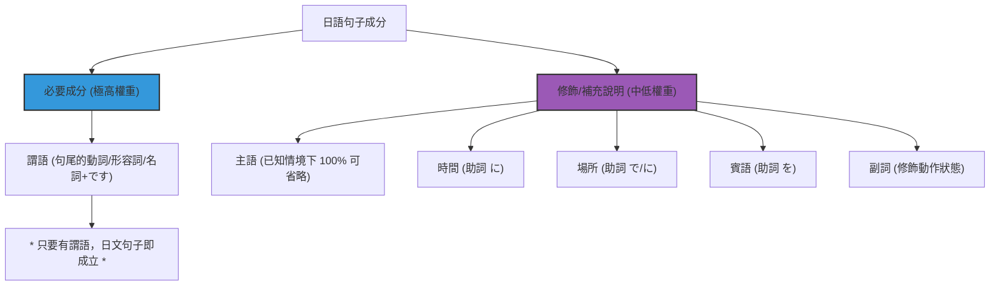

---
related_to:
  - "[[JP_Grammar_Verb_Conjugation]]"
  - "[[JP_Grammar_Noun_Conjugation]]"
  - "[[JP_Grammar_Adjective_Conjugation]]"
---
# 🇯🇵 日語造句、成分剖析與口語精簡指引

> [!important] 句子結構色彩標記：
> >  **主語/主題** (`#2ECC71`) \|  \|  **核心/謂語** (`#3498DB`) \|  \|  **修飾語/賓語** (`#E67E22`) \|  \|  **時間/場所/副詞** (`#E74C3C`)

本指南旨在幫學習者建立地道的日語造句邏輯，理解日語句子中「必要成分」與「修飾成分」的權重，並掌握日語口語對話中極致精簡的原則與回覆格式。

---

## 📂 第一部分：三大核心句型架構

日語造句的基本邏輯是 **SOV 結構**（主語 - 賓語 - 動詞），且 **謂語（決定時態與語氣的核心部分）永遠放在句子最後面**。

### 1. 名詞判斷句 (A is B)
*   **架構**：`🟢 主語/主題` + **は** + `🔵 名詞` + **です / だ**。
*   **例句**：これは<ruby>日本語<rt>にほんご</rt></ruby>の<ruby>本<rt>ほん</rt></ruby>です。  （這是日文書。）

### 2. 形容詞描述句 (A is Adjective)
*   **架構**：`🟢 主語/主題` + **は** + `🔵 形容詞` + **です / だ**。
*   **例句**：<ruby>今日<rt>きょう</rt></ruby>の<ruby>天気<rt>てんき</rt></ruby>は<ruby>寒<rt>さむ</rt></ruby>いです。  （今天的天氣很冷。）

### 3. 動詞敘述句 (A does B)
*   **架構**：`🟢 主語/主題` + **は** + `🔴 時間/場所` + `🟠 賓語` + **を** + `🔵 動詞`。
*   **例句**：<ruby>私<rt>わたし</rt></ruby>は<ruby>今日<rt>きょう</rt></ruby>、<ruby>家<rt>いえ</rt></ruby>で<ruby>林檎<rt>りんご</rt></ruby>を<ruby>食<rt>た</rt></ruby>べます。  （我今天在家吃蘋果。）

### 4. 四大詞類丁寧形語尾總表

三大句型的謂語變化，依詞類統一對照（詳細變化見各詞類專卡：

|  | 動詞 | 名詞 | い形容詞（肯定保留い，其餘去い變化） | な形容詞 |
| --- | --- | --- | --- | --- |
| 肯定 | 〜ます | 〜です | 〜い＋です | 〜です |
| 否定 | 〜ません | 〜じゃありません | 〜くない＋です | 〜じゃありません |
| 過去肯定 | 〜ました | 〜でした | 〜かった＋です | 〜でした |
| 過去否定 | 〜ませんでした | 〜じゃありませんでした | 〜くなかった＋です | 〜じゃありませんでした |
| 勧誘 | 〜ましょう | ✕ | ✕ | ✕ |
| 推測 | ✕ | 〜でしょう↘ | 〜でしょう↘ | 〜でしょう↘ |
| 確認 | ✕ | 〜でしょう↗ | 〜でしょう↗ | 〜でしょう↗ |

> [!tip] でしょう 語調規則：句尾下降↘↘推測（大概吧上揚↗↗確認（對吧。

### 5. 連體修飾：四詞類接名詞規則

任何詞類都能修飾名詞，接法各不同——**動詞修飾名詞必須用普通體（辞書形/た形等），不可用ます形**：

| 詞類 | 接法 | 例 |
| --- | --- | --- |
| 名詞 | ＋の＋名詞 | 日本語**の**本 |
| い形容詞 | 直接＋名詞 | <ruby>安<rt>やす</rt></ruby>い<ruby>本<rt>ほん</rt></ruby> |
| な形容詞 | ＋な＋名詞 | <ruby>有名<rt>ゆうめい</rt></ruby>**な**<ruby>本<rt>ほん</rt></ruby> |
| 動詞（普通體） | 直接＋名詞 | <ruby>買<rt>か</rt></ruby>っ**た**<ruby>本<rt>ほん</rt></ruby>、<ruby>読<rt>どく</rt></ruby>**む**<ruby>人<rt>にん</rt></ruby> |

- 詳細變化：[[JP_Grammar_Verb_Conjugation|動詞變化 @related_to]]、[[JP_Grammar_Noun_Conjugation|名詞變化 @related_to]]、[[JP_Grammar_Adjective_Conjugation|形容詞變化 @related_to]]

---

## 📂 第二部分：句子成分的權重：必要成分 vs 修飾成分

日語在語言學上屬於**高度情境依賴**的「高語境語言」。這導致日語句子的必要與修飾成分有著與中文、英文截然不同的權重。

```mermaid
graph TD
    A["日語句子成分"] --> B["必要成分 (極高權重)"]
    A --> C["修飾/補充說明 (中低權重)"]
    
    B --> B1["謂語 (句尾的動詞/形容詞/名詞+です)"]
    B1 --> B2["* 只要有謂語，日文句子即成立 *"]
    
    C --> C1["主語 (已知情境下 100% 可省略)"]
    C --> C2["時間 (助詞 に)"]
    C --> C3["場所 (助詞 で/に)"]
    C --> C4["賓語 (助詞 を)"]
    C --> C5["副詞 (修飾動作狀態)"]
    
    style B fill:#3498db,stroke:#333,stroke-width:2px;
    style C fill:#9b59b6,stroke:#333,stroke-width:2px;
```

### 1. 唯一必要成分：謂語（句尾）
在日語中，唯一**在語意和語法上絕能省略**的，就是放在句尾的 **「謂語（動詞/形容詞/名詞+です）」**。只要謂語存在，即使沒有主語和賓語，句子依然完全成立。
*   例句：<ruby>食<rt>た</rt></ruby>べます。 (我要吃。 / 成立)
*   例句：<ruby>寒<rt>さむ</rt></ruby>いです。 (好冷。 / 成立)

### 2. 修飾與補充成分（可省略）
除了句尾謂語外，其他所有成分均屬於「補充說」或「修飾」。只要在對話情境中雙方心知肚明，皆應予以省略：
*   **主語 / 主題（は / が）**：最容易被省略。日語極度忌諱反覆說`私は` (我) 或 `あなたは` (你。
*   **時間（に） / 場所（で / に）**：提供動作背景，非必要。
*   **賓語（を）**：動作承受者。若指著蘋果問「吃嗎，不需說蘋果」，直接說」即可。

---

## 📂 第三部分：口語對話的極致精簡法則

地道的日語口語聽起來非常簡短，主要透過以下三個法則進行精簡：

### 法則 ①：主語/主題「全面消失」
除非要強調「是誰」或「在對比什麼」，否則不說語。
*   教科書式（贅言）：~~私は明日京都に行きます。~~
*   地道口語（精簡）：<ruby>明日<rt>あした</rt></ruby>、<ruby>京都<rt>きょうと</rt></ruby>に<ruby>行<rt>い</rt></ruby>く。 (明天去京都。)

### 法則 ②：名詞代用（Copula 代替動詞）
口語回答時，常直接用 **「名詞 + です（/ だ）」** 代替一整串動詞動作，日文稱為「鰻魚句（ウナギ文）」。
*   情境：詢問「你天要去哪？」
*   一般回答：~~私は京都に行きます。~~ (我去京都。)
*   精簡回答：<ruby>京都<rt>きょうと</rt></ruby>です。 (京都。/ 意即：去京都。)

### 法則 ③：時態與語氣助詞縮讀（Contractions）
口語中，進行時態或懊惱時態會進行音變縮讀：
*   `ています` (正在) → **てる** （例：知っている → **知ってる**）
*   `てしまいます` (不小心做完) → **ちゃう** （例：忘れてしまった → **忘れちゃった**）
*   `てはおけない` (不能不管) → **ちゃおけない**

---

## 📂 第四部分：地道問答與潛在回覆格式對照表

利用上述精簡原則，日常問答的實際潛在回覆格式如下：

| 情境與提問 | 教科書式回答 (贅言) | 地道極簡回答 (推薦) | 語法精簡解析 |
| :--- | :--- | :--- | :--- |
| **① 詢問意願**  「コーヒーを飲みますか。」  (喝咖啡嗎) | ~~「はい、私はコーヒーを飲みます。」~~ | 「うん、飲む。」(要喝。)  「ううん、飲まない。」(不喝。) | 省略主語「我」與賓語「咖啡」，直接以動詞普通體（肯定/否定）回答。 |
| **② 詢問去處**  「昨日、どこに行きましたか。」  (昨天去哪？) | ~~「私は昨日、デパートに行きました。」~~ | 「デパートです。」(百貨公司。)  「デパートに行きました。」(去百貨公司。) | 省略主語與時間「昨天」，直接用「目的地 + です」或「目的地 + 動詞」回答。 |
| **③ 詢問狀態**  「お腹が空きましたか。」  (肚子餓了嗎) | ~~「はい、私はお腹が空きました。」~~ | 「うん、ペコペコ。」(嗯扁了。)  「ううん、大丈夫。」(不，還好。) | 甚至不使用動詞「空きました」，直接用擬態詞（ペコペコ）或形容動詞回答。 |
| **④ 尋求確認**  「もう宿題をやった？」  (作業寫完了嗎) | ~~「いいえ、私はまだ宿題をやっていません。」~~ | 「ううん、まだやってない。」(還沒寫。)  「ううん、まだ。」(還沒。) | 省略主語與賓語作業，直接以「副詞 まだ + 動詞口語否定」或單獨用「副詞 まだ」回答。 |

---

## 📂 第五部分：🎥 實用口語超短句 100 選（極致精簡表達）

以下為影片精選之日本人日常高頻使用的迷你句，展現了高語境下「省略主語」、「代用名詞」以及「極簡動詞語尾」的實際口語樣貌：

### 1. 日常社交與反應 (Social & Instant Responses)
| 日文句子 | 羅馬拼音 | 中文意思 | 結構解析與精簡特徵|
| :--- | :--- | :--- | :--- |
| **ありがとう。** | *Arigatou.* | 謝謝。 | 省略丁寧語尾 `ございます`。 |
| **おはよう。** | *Ohayou.* | 早安。 | 省略丁寧語尾 `ございます`。 |
| **おやすみ。** | *Oyasumi.* | 晚。 | 省略丁寧語尾 `なさい`。 |
| **ただいま。** | *Tadaima.* | 我回來了。 | 源自「只今戻りました」，省略動詞，僅留時間副詞「只今」。 |
| **おかえり。** | *Okaeri.* | 你來了。 | 省略丁寧語尾 `なさい`。 |
| **<ruby>行<rt>い</rt></ruby>ってきます。** | *Ittekimasu.* | 我出門了。 | 移動動詞相連的口語固定說。 |
| **いってらっしゃい。** | *Itterasshai.* | 慢走。 | 叮嚀對方出門並回來的語氣。 |
| **またね。** | *Mata ne.* | 再見/待會見。 | 省略動詞，僅保留「副詞 + 終助詞」。 |
| **また<ruby>今度<rt>こんど</rt></ruby>ね。** | *Mata kondo ne.* | 下次見。 | 同上，省略謂語。 |
| **<ruby>気を付<rt>きをつ</rt></ruby>けて。** | *Ki wo tsukete.* | 路上小心/注意安全。 | 省略 `ください`。 |
| **やった！<ruby>嬉<rt>うれ</rt></ruby>しい。** | *Yatta! Ureshii.* | 太好了！好高興。 | 直接用動詞過去式（やった）與形容詞（嬉しい）表達強烈情緒。 |
| **<ruby>残念<rt>ざんねん</rt></ruby>。** | *Zannen.* | 可惜/遺憾。 | 單獨名詞句，直接作謂語。 |
| **お<ruby>腹<rt>はら</rt></ruby>ペコペコ。** | *Onaka pekopeko.* | 肚子好餓。 | 狀態省略：省略 `が空きました`，以擬態詞直接結尾。 |
| **お<ruby>腹<rt>はら</rt></ruby>すいた。** | *Onaka suita.* | 肚子餓了。 | 省略主格助詞 `が`。 |
| **おいしい！** | *Oishii!* | 好吃！ | 形容詞普通體直接結尾。 |
| **<ruby>大好<rt>だいす</rt></ruby>き！** | *Daisuki!* | 最喜歡！ | な形容詞直接結尾，省略 `です`。 |
| **<ruby>疲<rt>つか</rt></ruby>れた。** | *Tsukareta.* | 累了。 | 動詞過去式普通體直接結尾。 |
| **<ruby>最高<rt>さいこう</rt></ruby>だね。** | *Saikou da ne.* | 最棒了呢 | 名詞 + `だ` + 終助詞 `ね`。 |
| **いい<ruby>感<rt>かん</rt></ruby>じ。** | *Ii kanji.* | 感覺不錯。 | 名詞直接作謂語，極致精簡。 |
| **うるさいよ。** | *Urusai yo.* | 吵了。 | 形容詞直接結尾加強烈終助詞 `よ`。 |

### 2. 行動、意願與要求 (Actions & Volitions)
| 日文句子 | 羅馬拼音 | 中文意思 | 結構解析與精簡特徵|
| :--- | :--- | :--- | :--- |
| **やってみて。** | *Yatte mite.* | 試試看吧 | `て形` 接 `みる` (嘗試)，省略 `ください`。 |
| **やってみなよ。** | *Yatte mina yo.* | 試試看啊 | `てみな` 是 `てみなさい` 的口語略寫，帶有催促與終助詞。 |
| **ねえ、やってみようよ。** | *Nee, yatte miyou yo.* | 吶，試試看吧 | 勸誘形 `みよう` 加上催促終助詞。 |
| **できた！** | *Dekita!* | 做好了/完成了。 | 可能動詞/狀態動詞過去式，表示動作完成。 |
| **<ruby>見<rt>み</rt></ruby>てみて。** | *Mite mite.* | 你你。 | `て形` 重疊，表示口語中的急切與催促。 |
| **もっと。** | *Motto.* | 還要/更多。 | 單獨副詞直接作為要求謂語。 |
| **これちょうだい。** | *Kore choudai.* | 這個給我。 | 口語求取表現，等同於 `これをください`。 |
| **<ruby>貸<rt>か</rt></ruby>して。** | *Kashite.* | 借我。 | `て形` 直接結尾，省略 `ください`。 |
| **<ruby>待<rt>ま</rt></ruby>って。** | *Matte.* | 等等。 | `て形` 直接結尾，最常用的命令句精簡版。 |
| **<ruby>早<rt>はや</rt></ruby>く！** | *Hayaku!* | 快點！ | 形容詞副詞化，省略後續動詞 `動いて`。 |
| **<ruby>早<rt>はや</rt></ruby>くして。** | *Hayaku shite.* | 快一點。 | 形容詞副詞化接 `する` 的 `て形`。 |
| **<ruby>遅<rt>おそ</rt></ruby>いよ。** | *Osoi yo.* | 太慢了。 | 形容詞直結表示責備。 |
| **<ruby>一緒<rt>いっしょ</rt></ruby>にやろう。** | *Issho ni yarou.* | 一起做吧 | 意志形 `やろう` 表示邀請。 |
| **<ruby>嫌<rt>いや</rt></ruby>だ！ / いやだ！** | *Iya da!* | 不要！ | な形容詞 `嫌` + 斷定 `だ`。 |
| **これ<ruby>好<rt>す</rt></ruby>き。** | *Kore suki.* | 喜歡這個。 | 省略助詞 `が` 與丁寧結尾 `です`。 |
| **<ruby>遊<rt>あそ</rt></ruby>ぼう。** | *Asobou.* | 玩吧 | 動詞意志形表示提議。 |
| **<ruby>聞<rt>き</rt></ruby>いて<ruby>聞<rt>き</rt></ruby>いて。** | *Kiite kiite.* | 聽我說我說 | `て形` 重複。 |
| **<ruby>教<rt>おし</rt></ruby>えて。** | *Oshiete.* | 教我/告訴我。 | 省略 `ください`。 |
| **<ruby>待<rt>ま</rt></ruby>って、<ruby>今<rt>いま</rt></ruby><ruby>行<rt>い</rt></ruby>く。** | *Matte, ima iku.* | 等等，我現在過去。 | 兩個動詞的極簡句。 |
| **これ<ruby>僕<rt>ぼく</rt></ruby>の。** | *Kore boku no.* | 這是我的。 | 省略 `本 / 物` 與 `です`。 |
| **<ruby>食<rt>た</rt></ruby>べたい。** | *Tabetai.* | 想吃。 | 願望助動詞 `たい` 直接結尾。 |
| **こっちが<ruby>良<rt>よ</rt></ruby>い。** | *Kocchi ga ii.* | 這邊比較好。 | 指示代名詞口語形 `こっち` + 助詞 `が` + 形容詞。 |
| **もう<ruby>寝<rt>ね</rt></ruby>る。** | *Mou neru.* | 要睡了。 | 副詞 `もう` + 辭書形，表即將發生的動作。 |
| **お<ruby>手伝<rt>てつだ</rt></ruby>いする。** | *Otetsudai suru.* | 我幫。 | 謙讓表達，省略主語。 |
| **<ruby>待<rt>ま</rt></ruby>ちきれない。** | *Machikirenai.* | 等不及了。 | 動詞可能否定形。 |
| **<ruby>面白<rt>おもしろ</rt></ruby>そう。** | *Omoshirosou.* | 好像很有趣。 | 樣態助動詞，省略 `です`。 |
| **いいえ<ruby>結構<rt>けっこう</rt></ruby>です。** | *Iie kekkou desu.* | 不用了/夠。 | 婉拒標準句。 |
| **もう<ruby>我慢<rt>がまん</rt></ruby>できない。** | *Mou gaman dekinai.* | 受夠/無法忍受。 | 可能否定普通體結尾。 |
| **どうでもいいよ。** | *Dou demo ii yo.* | 怎樣都無所謂啦 | 慣用極簡句。 |
| **これ<ruby>気に入<rt>きにい</rt></ruby>った。** | *Kore kiniitta.* | 我相中這個了。 | 慣用句過去式，表示喜好已定下。 |
| **そろそろ<ruby>帰<rt>かえ</rt></ruby>ろう。** | *Sorosoro kaerou.* | 差不多該回去了。 | 副詞 `そろそろ` + 意志形。 |
| **いいんじゃない。** | *Iin janai.* | 不是挺好的嗎 | `ではない` 的口語縮讀 `じゃない`。 |
| **やってみなよ。** | *Yatte mina yo.* | 試試看啊 | 帶有催促與終助詞。 |
| **そっちに<ruby>行<rt>い</rt></ruby>こうか。** | *Socchi ni ikou ka.* | 往那邊去吧 | 指示代名詞 + 意志形 + 疑問終助詞。 |
| **ちょっと<ruby>黙<rt>だま</rt></ruby>ってて。** | *Chotto damattete.* | 稍微安靜一下。 | `ている` 縮讀為 `てる` 的 `て形`（黙っていて → 黙ってて）。 |
| **まあ<ruby>楽<rt>たの</rt></ruby>しもうよ。** | *Maa tanoshimou yo.* | 嘛，享受吧 | 意志形 + 催促。 |

### 3. 詢問、確認與質疑 (Questions & Doubts)
| 日文句子 | 羅馬拼音 | 中文意思 | 結構解析與精簡特徵|
| :--- | :--- | :--- | :--- |
| **これ<ruby>何<rt>なに</rt></ruby>？** | *Kore nani?* | 這是什麼？ | 省略助詞 `は` 與疑問詞後的 `ですか`。 |
| **あれは<ruby>何<rt>なに</rt></ruby>？** | *Are wa nani?* | 那是什麼？ | 同上。 |
| **<ruby>本当<rt>ほんとう</rt></ruby>？** | *Hontou?* | 真的嗎 | 單獨名詞，句尾音調上揚表疑問。 |
| **<ruby>嘘<rt>うそ</rt></ruby>でしょ。** | *Uso desho.* | 騙人的吧不會吧 | 名詞 + `でしょう` 縮讀，句尾上揚表質疑。 |
| **これってどういうこと？** | *Kore tte douiu koto?* | 這是什麼意思？ | `って` 表主題提議（口語 `とは`），省略 `ですか`。 |
| **ねえねえ、<ruby>知<rt>し</rt></ruby>ってる？** | *Nee nee, shitteru?* | 吶吶，你道嗎 | `ています` 縮讀為 `てる`。 |
| **どこに<ruby>行<rt>い</rt></ruby>くの？** | *Doko ni iku no?* | 要去哪？ | `の` 作為口語疑問助詞（代替 `動詞ますか`）。 |
| **これってどうするの？** | *Kore tte dou suru no?* | 這個要怎麼做？ | 同上，省略 `のですか` 變為 `の`。 |
| **<ruby>今<rt>いま</rt></ruby><ruby>何時<rt>なんじ</rt></ruby>？** | *Ima nanji?* | 現在幾點？ | 省略 `ですか`。 |
| **マジで？** | *Maji de?* | 真的假的？ | 俗語，句尾上揚。 |
| **え、なんで？** | *E, nande?* | 誒為什麼？ | 疑問副詞。 |
| **<ruby>信<rt>しん</rt></ruby>じられない。** | *Shinjirarenai.* | 難以置信。 | 可能動詞否定形。 |
| **<ruby>忙<rt>いそが</rt></ruby>しいの？** | *Isogashii no?* | 很忙嗎 | 形容詞 + `の` 表疑問。 |
| **それって<ruby>何<rt>なん</rt></ruby>だっけ？** | *Sore tte nan dakke?* | 那是什麼來著？ | `だっけ` 用於回想與確認。 |
| **<ruby>聞<rt>き</rt></ruby>こえた？** | *Kikoeta?* | 聽到了嗎 | 自發動詞過去形普通體上揚表疑問。 |
| **どっちが<ruby>好<rt>す</rt></ruby>き？** | *Docchi ga suki?* | 喜歡哪個？ | 省略 `ですか`。 |
| **<ruby>覚<rt>おぼ</rt></ruby>えた？** | *Oboeta?* | 記住了嗎 | 動詞過去形普通體上揚表疑問。 |
| **<ruby>質問<rt>しつもん</rt></ruby>ある？** | *Shitsumon aru?* | 有問題嗎 | 省略助詞 `が` 與 `りますか`。 |
| **この<ruby>本読<rt>ほんどく</rt></ruby>んだ？** | *Kono hon yonda?* | 這本書讀過了嗎 | 省略助詞 `を`。 |
| **あれどこ？** | *Are doko?* | 那在哪？ | 省略 `はどこですか`。 |
| **ねえ<ruby>覚<rt>おぼ</rt></ruby>えてる？** | *Nee oboeteru?* | 吶，還記得嗎 | `ている` 縮讀為 `てる`。 |
| **これってどう<ruby>思<rt>おも</rt></ruby>う？** | *Kore tte dou omou?* | 這個你麼想？ | 省略 `と思いますか`。 |
| **それって<ruby>本気<rt>ほんき</rt></ruby>？** | *Sore tte honki?* | 那是認真的嗎 | 省略 `ですか`。 |
| **なんでそうなるの？** | *Nande sou naru no?* | 為什麼會變成那樣？ | `の` 表質疑問句。 |
| **ねえねえちょっといい？** | *Nee nee chotto ii?* | 吶吶，可以耽誤一下嗎 | 口語商量常用開頭。 |
| **なんでわかるの？** | *Nande wakaru no?* | 你麼知道的？ | `の` 疑問句。 |
| **ねえ<ruby>聞<rt>き</rt></ruby>いてる？** | *Nee kiiteru?* | 吶，你聽嗎 | `ている` 縮讀為 `てる`。 |
| **え、どういうこと？** | *E, douiu koto?* | 誒什麼意思？ | 疑問句。 |
| **<ruby>大丈夫<rt>だいじょうぶ</rt></ruby>かな？** | *Daijoubu kana?* | 沒事吧（自言自語或輕微詢問） | 名詞 + `かな` 表示不確定。 |
| **<ruby>何<rt>なに</rt></ruby>それ、<ruby>受<rt>う</rt></ruby>ける！** | *Nani sore, ukeru!* | 那是什麼，好好笑！ | `受ける` 口語表示超好笑、有笑點。 |

---

## 📂 第六部分：🎥 實用地道 Q&A 問答對話組（30 選）

以下為影片精選之 30 組一問一答日常超短句會話，展示了如何在真實對話中運用極簡語法、省略主賓語並以最道地的方式進行回應：

| 編號 | 提問 (Question) | 回答 (Answer) | 中文意思對照 | 語意與精簡特點解析 |
| :--- | :--- | :--- | :--- | :--- |
| **01** | **お<ruby>元気<rt>げんき</rt></ruby>ですか？** | **<ruby>元気<rt>げんき</rt></ruby>だよ、ありがとう。** | 你近怎麼樣？ 我很好，謝謝。 | 日常最簡短的問候，省略主語「我/你。 |
| **02** | **今日、天気どう？** | **晴れて気持ちいいよ。** | 今天天氣怎麼樣？ 天氣晴朗，感覺很好。 | 提問省略了 `は`。回答使用 `て形` (晴れて) 接續感覺。 |
| **03** | **何してるの？** | **今、少し勉強中だよ。** | 你做什麼？ 我現在在學習一點東西。 | `<ruby>勉強中<rt>べんきょうちゅう</rt></ruby>` <ruby>名詞<rt>めいし</rt></ruby><ruby>直接<rt>ちょくせつ</rt></ruby><ruby>代替<rt>だいたい</rt></ruby><ruby>動詞<rt>どうし</rt></ruby>「<ruby>在學<rt>ざいがく</rt></ruby><ruby>習<rt>しゅう</rt></ruby>」<ruby>作<rt>さく</rt></ruby><ruby>謂<rt>い</rt></ruby><ruby>語<rt>ご</rt></ruby>。 |
| **04** | **コーヒー飲む？** | **飲むよ、ちょうど飲みたかった。** | 要喝咖啡嗎 要喝，我正好想喝呢 | 提問省略 `を`。回答省略賓語，直接用 `〜たい` 過去式表示願望。 |
| **05** | **どう思う？** | **いい考えだと思う。** | 你麼看？ 我覺得這是一個好主意。 | <ruby>答<rt>こたえ</rt></ruby><ruby>句<rt>く</rt></ruby><ruby>用<rt>よう</rt></ruby> `と<ruby>思<rt>おも</rt></ruby>う` <ruby>縮<rt>しゅく</rt></ruby><ruby>短<rt>たん</rt></ruby><ruby>表<rt>おもて</rt></ruby><ruby>達<rt>とおる</rt></ruby><ruby>想<rt>そう</rt></ruby><ruby>法<rt>ほう</rt></ruby>。 |
| **06** | **どこ行くの？** | **スーパーで食材買ってくる。** | 你去哪？ 我要去超市買食材。 | `<ruby>買<rt>か</rt></ruby>ってあげる/くる` <ruby>複合<rt>ふくごう</rt></ruby><ruby>動詞<rt>どうし</rt></ruby><ruby>結構<rt>けっこう</rt></ruby>。 |
| **07** | **好き？** | **色もデザインもいいね。** | 你歡這個嗎 嗯顏色和設計都不錯。 | 提問極致省略為單一詞彙。回答迴避了直接回答「喜歡」，用特徵述。 |
| **08** | **助けてくれる？** | **もちろん、任せて！** | 你幫一下嗎 當然，交給我吧 | <ruby>答<rt>こたえ</rt></ruby><ruby>句<rt>く</rt></ruby> `<ruby>任<rt>まか</rt></ruby>せて` <ruby>是<rt>これ</rt></ruby> `<ruby>任<rt>まか</rt></ruby>せてください` <ruby>的<rt>てき</rt></ruby><ruby>極<rt>きょく</rt></ruby><ruby>簡<rt>かん</rt></ruby><ruby>省略<rt>しょうりゃく</rt></ruby>。 |
| **09** | **その本、面白い？** | **すごく面白いよ！** | 那本書有趣嗎 非常有趣！ | 回答直接使用形容詞普通體 + `よ`。 |
| **10** | **今、忙しい？** | **少しだけ、まあ大丈夫。** | 你在忙嗎 稍微有點忙，不過還行。 | 回答全名詞化，省略所有動詞與形容詞。 |
| **11** | **何時に寝る？** | **だいたい11時ごろ。** | 你點睡覺？ 大概 11 點左右。 | 回答省略動詞 `寝ます`。 |
| **12** | **何が好き？** | **ねこが好きで、癒されるんだ。** | 你歡什麼？ 我喜歡貓它們讓我感到療癒。 | <ruby>使用<rt>しよう</rt></ruby><ruby>被動<rt>ひどう</rt></ruby><ruby>動詞<rt>どうし</rt></ruby> `<ruby>癒<rt>いや</rt></ruby>される` <ruby>表示<rt>ひょうじ</rt></ruby><ruby>被<rt>ひ</rt></ruby><ruby>療<rt>りょう</rt></ruby><ruby>癒<rt>ゆ</rt></ruby>。 |
| **13** | **電話できる？** | **今すぐかけるね。** | 可以打電話嗎 可以，我馬上打。 | 回答使用 `かける` (撥打) 代替 `電話する`。 |
| **14** | **仕事忙しい？** | **最近ちょっとバタバタしてるよ。** | 你作忙嗎 最近有點忙亂。 | <ruby>擬態<rt>ぎたい</rt></ruby><ruby>詞<rt>し</rt></ruby> `バタバタ` <ruby>口語<rt>こうご</rt></ruby><ruby>表示<rt>ひょうじ</rt></ruby><ruby>忙<rt>ぼう</rt></ruby><ruby>得<rt>え</rt></ruby><ruby>不可<rt>ふか</rt></ruby><ruby>開<rt>かい</rt></ruby><ruby>交<rt>こう</rt></ruby>。 |
| **15** | **その映画、楽しい？** | **最高に面白いよ！** | 那部電影好看嗎 超級有趣！ | 提問使用形容詞，回答使用另個形容詞強調。 |
| **16** | **何が食べたい？** | **ピザが食べたいな。** | 你吃什麼？ 我想吃披薩。 | <ruby>願望<rt>がんぼう</rt></ruby> `〜たい` <ruby>加上<rt>かじょう</rt></ruby><ruby>緩和<rt>かんわ</rt></ruby><ruby>口氣<rt>こうき</rt></ruby><ruby>的<rt>てき</rt></ruby><ruby>終助詞<rt>しゅうじょし</rt></ruby> `な`。 |
| **17** | **一緒に行く？** | **もちろん、一緒に行こう！** | 一起去嗎 當然，一起去吧 | <ruby>答<rt>こたえ</rt></ruby><ruby>句<rt>く</rt></ruby><ruby>使用<rt>しよう</rt></ruby><ruby>意志<rt>いし</rt></ruby><ruby>形<rt>かたち</rt></ruby> `<ruby>行<rt>い</rt></ruby>こう` <ruby>表<rt>おもて</rt></ruby><ruby>邀<rt>よう</rt></ruby><ruby>請<rt>せい</rt></ruby>。 |
| **18** | **日本語、難しい？** | **少し難しいけど、頑張ってるよ。** | 日文難嗎 有點難，但我正在努力。 | `頑張っている` 縮讀為 `頑張ってる`。 |
| **19** | **<ruby>明日<rt>あした</rt></ruby>、<ruby>暇<rt>ひま</rt></ruby>？** | **ごめん、明日は予定があるんだ。** | <ruby>明<rt>めい</rt></ruby><ruby>天<rt>てん</rt></ruby><ruby>有<rt>あり</rt></ruby><ruby>空<rt>そら</rt></ruby><ruby>嗎<rt></rt></ruby>r><ruby>抱<rt>ほう</rt></ruby><ruby>歉<rt>けん</rt></ruby>，<ruby>明<rt>めい</rt></ruby><ruby>天<rt>てん</rt></ruby><ruby>有安<rt>ありやす</rt></ruby><ruby>排<rt>はい</rt></ruby>。 | 答句用 `あるんだ` (口語 `あるのです`) 加強解釋語氣。 |
| **20** | **お茶入れる？** | **お願い、温かいのが嬉しい。** | 幫茶嗎 拜託了，熱茶最好了。 | 回答用 `お願い` 代替 `お願いします`。 |
| **21** | **一人暮らししてる？** | **そうだよ、一人暮らしも慣れた。** | 你住嗎 是啊經習慣了獨自生活。 | `<ruby>慣<rt>な</rt></ruby>れる` <ruby>過去<rt>かこ</rt></ruby><ruby>式<rt>しき</rt></ruby><ruby>普通<rt>ふつう</rt></ruby><ruby>體<rt>からだ</rt></ruby><ruby>結尾<rt>けつび</rt></ruby>。 |
| **22** | **何か手伝おうか？** | **ありがとう、でも今は大丈夫。** | 需要幫 謝謝，不過現在不用了。 | `〜ましょうか` <ruby>的<rt>てき</rt></ruby><ruby>口語<rt>こうご</rt></ruby><ruby>意志<rt>いし</rt></ruby><ruby>形<rt>かたち</rt></ruby><ruby>問<rt>とん</rt></ruby><ruby>句<rt>く</rt></ruby> `〜おうか`。 |
| **23** | **風邪ひいた？** | **少しだけど、無理しないよ。** | 感冒了嗎 有點輕微感冒，不過我會注意。 | <ruby>答<rt>こたえ</rt></ruby><ruby>句<rt>く</rt></ruby><ruby>用<rt>よう</rt></ruby><ruby>動詞<rt>どうし</rt></ruby><ruby>否定<rt>ひてい</rt></ruby><ruby>表示<rt>ひょうじ</rt></ruby>「<ruby>不勉強<rt>ふべんきょう</rt></ruby><ruby>自己<rt>じこ</rt></ruby>」。 |
| **24** | **どうやって行く？** | **電車で行くよ、便利だからね。** | 你去？ 搭電車去，因為很方便。 | <ruby>答<rt>こたえ</rt></ruby><ruby>句<rt>く</rt></ruby><ruby>使用<rt>しよう</rt></ruby><ruby>理由<rt>りゆう</rt></ruby><ruby>接續詞<rt>せつぞくし</rt></ruby> `だから` <ruby>放<rt>ほう</rt></ruby><ruby>在<rt>ざい</rt></ruby><ruby>句<rt>く</rt></ruby><ruby>尾<rt>お</rt></ruby>。 |
| **25** | **覚えてる？** | **ばっちり覚えてるよ。** | 還記得嗎 記得很清楚呢| `ばっちり` <ruby>副詞<rt>ふくし</rt></ruby><ruby>表示<rt>ひょうじ</rt></ruby><ruby>完<rt>かん</rt></ruby><ruby>美<rt>び</rt></ruby>、<ruby>十<rt>じゅう</rt></ruby><ruby>足<rt>あし</rt></ruby>。 |
| **26** | **傘、持ってる？** | **持ってるよ、大丈夫。** | 有帶傘嗎 有，沒問題。 | <ruby>答<rt>こたえ</rt></ruby><ruby>句<rt>く</rt></ruby><ruby>省略<rt>しょうりゃく</rt></ruby><ruby>賓語<rt>ひんご</rt></ruby> `<ruby>傘<rt>かさ</rt></ruby>を`。 |
| **27** | **お酒、強い？** | **いえ、弱い方かな。** | 酒量好嗎 不，我算弱的吧| `<ruby>弱<rt>よわ</rt></ruby>い<ruby>方<rt>ほう</rt></ruby>` <ruby>表示<rt>ひょうじ</rt></ruby>「<ruby>屬<rt>ぞく</rt></ruby><ruby>於<rt>お</rt></ruby><ruby>弱<rt>じゃく</rt></ruby><ruby>的<rt>てき</rt></ruby><ruby>那<rt>な</rt></ruby><ruby>一邊<rt>いっぺん</rt></ruby>/<ruby>類型<rt>るいけい</rt></ruby>」。 |
| **28** | **明日、どこ行く？** | **買い物に行く予定。** | 明天去哪 明天打算去逛 | 回答用 `名詞 + 予定` 直接結尾。 |
| **29** | **この道は合ってる？** | **たぶん、合ってると思う。** | 這條路對嗎 應該是對的吧| 提問與回答均使用 `合っている` 縮讀為 `合ってる`。 |
| **30** | **すぐ終わる？** | **あと5分くらいかな。** | 很快就結束嗎 大概還有 5 分鐘吧| 回答全為名詞/時間詞加 `かな` (表示推測)。 |

